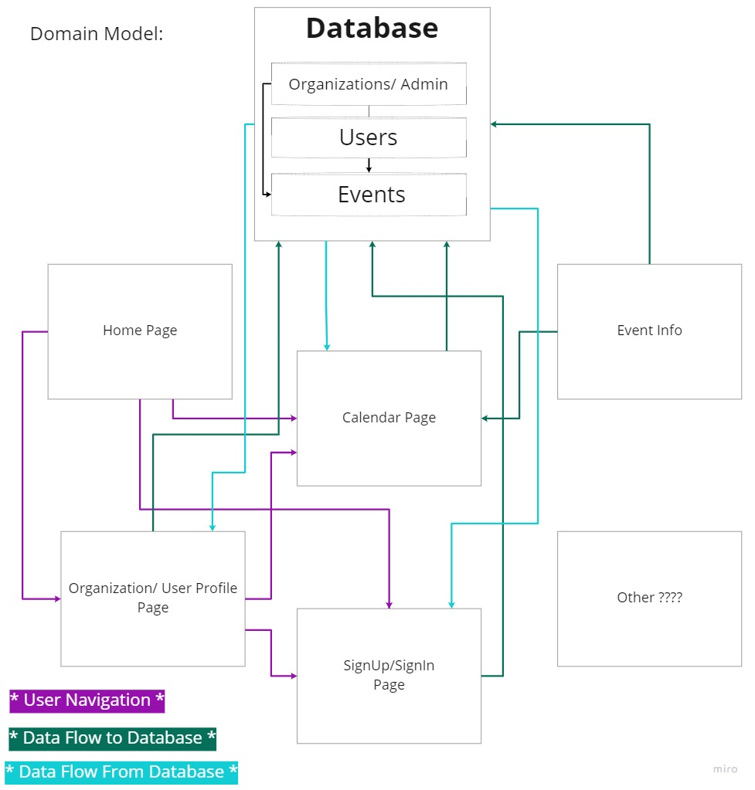

# Software Requirements

## Vision

- The vision of the product is a task/event management client that can be used by individuals, families or businesses to organize a schedule, assign tasks to individuals within their organization and allow for simple and slick editing of events, tasks and people.

## Scope

- What Event-Master **will** do
  - Provide users and organization administrators the abiity to create and assign and reassign tasks to themselves or Organization members
  - Give non-admin Organization members the ability to see both their schedule and the schedule of other members of the organization in a view of their choosing (day, week, month)
  - Create an easy to edit user experience with the ability to drag and drop tasks around the calendar to shift their due dates without needing to specifically edit each event.
  - Ability to set reminders via pop-up or email
  - Calendar is smart enough to understand scheduling conflicts, and alert the user when attempt to schedule a conflict is made

- What Event-Master will *not* do
  - Will not have a chat program built into user organizations. Communication within the Org must be handled by methods outside of Event-Master
  - Will not sync up with calendar applications (Google Calendar, Apple Calendar etc.)
  - Will not have a standalone/desktop application

## Minimum Viable Product

MVP will consist of a webpage that greets the user with a sign-in screen and after logging in or creating a new account the user is routed to a calendar-view page where they can see a broad view of tasks which provide additional detail on-hover. Regular users will be allowed to create tasks for themselves with the ability to create a deadline, time, category of task and description of task. They will also be able to complete a task and remove it from the to-do category. Enterprise or Organizations will be handled by an administrator(s) that handle the creation and assigning of tasks to users within the organization. Those non-admin users will only be able to mark their assignments as complete, not change details or due dates. Multiple users can be assigned to a single task. Users can elect to receive reminders via their sign-in email or through a browser pop-up.

## Stretch

- Live-sharing/updating when other users within an organization make changes
- Tracking and displaying users logged in on an organizations calendar
- Allow users to opt-in for SMS reminders

## Functional Requirements

- Admins can create, assign and edit tasks for all users in their organization
- Admins can add or remove users from their organization
- non-admin users in an Organization can flag tasks as completed but are unable to reassign or edit the details of the task
- Basic users (non Organization) have all permissions for their own calendar

## Data Flow

## Non-Functional Requirements

- Usability
  - How: Create a highly interactive calendar where most actions (add, assign, complete, remove) can be accomplished without being rerouted a different page
  - Why: Improve user experience and ease-of-use
  - What:

- Testability
  - How: Implement test cases for potential conflicts or app-breaking requests
  - Why: Better to build an app slowly and test each new function for potential bugs than to finish an app and test for all potential break-points at once.
  - What:

  [Back to README](README.md)
